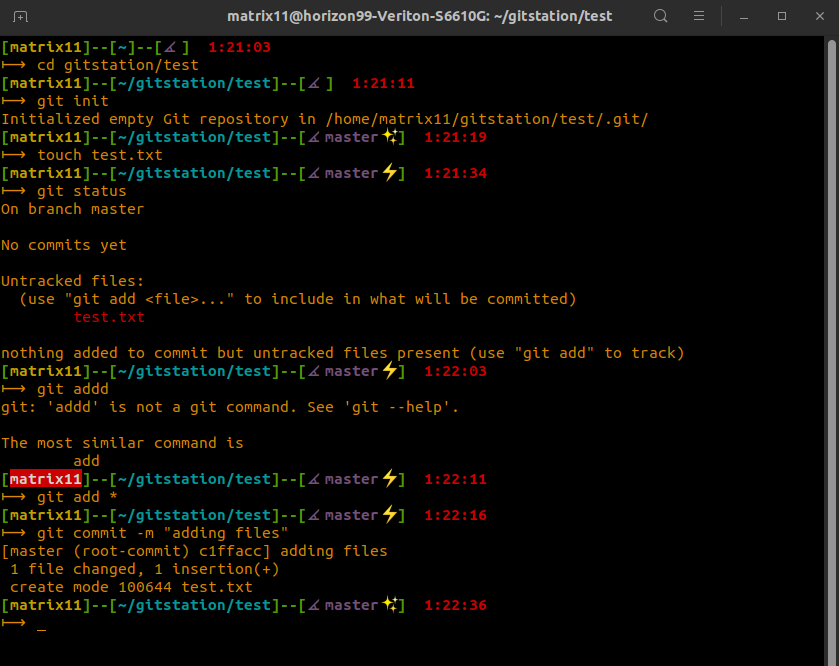

# plain-ui
v1.0
plain-ui is zsh theme working with oh-my-zsh configuration.

## Step for Install
1. Clone this repository into your local system.
2. Copy `plain-ui.zsh-theme` file to `~/.oh-my-zsh/themes/`.
3. Refresh terminal source with running command `source ~/.zshrc`. If it is not working then close your terminal and re-open it.

## Features
1. Display `username`, `current directory`, `git status` and `time` on shell.
2. Use different symbols to know `files status` of git.
3. Display `current working branch` of git.
4. Trigger color change on `username` when wrong, partial or unknown command is entered.

## Screenshot
